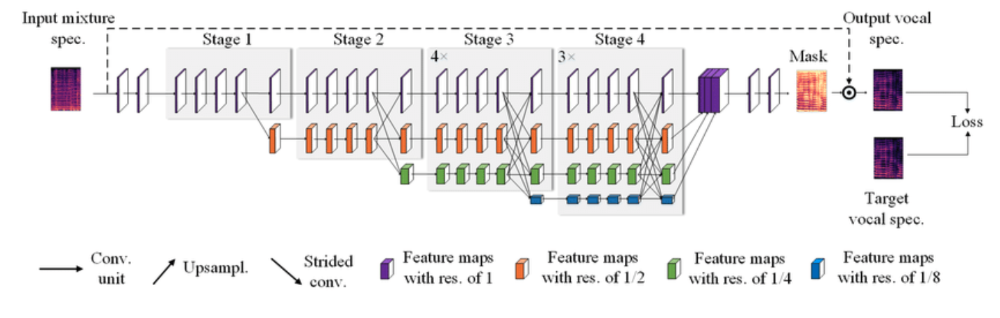
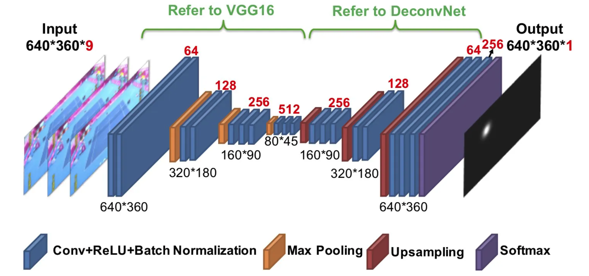

# soccer_analytics
This repo unites separate work regarding keypoints/pitch detection, ball detection, players detection, in different sports such as football, basketball, tennis.
For the keypoint detection I used Yolo-pose models, which proved not so accurate comparing to HRNet(High resolution networks, paper link: https://arxiv.org/pdf/1908.07919) which consists of multi-stage convolutions in order to accurately track keypoints positions.

For the ball detection models, the best architecture proved to be TrackNet(paper_link:https://arxiv.org/pdf/1907.03698). For football, basketball, tennis, the input of the network consists of groups of 3 consecutive frame of shapes (720,1280), which makes the inference a bit more costly, but the performance is visible, as well as better generalization compared to other networks(e.g. yolo). The training notebooks can be fond inside the /ball folder.

](tactical.gif)